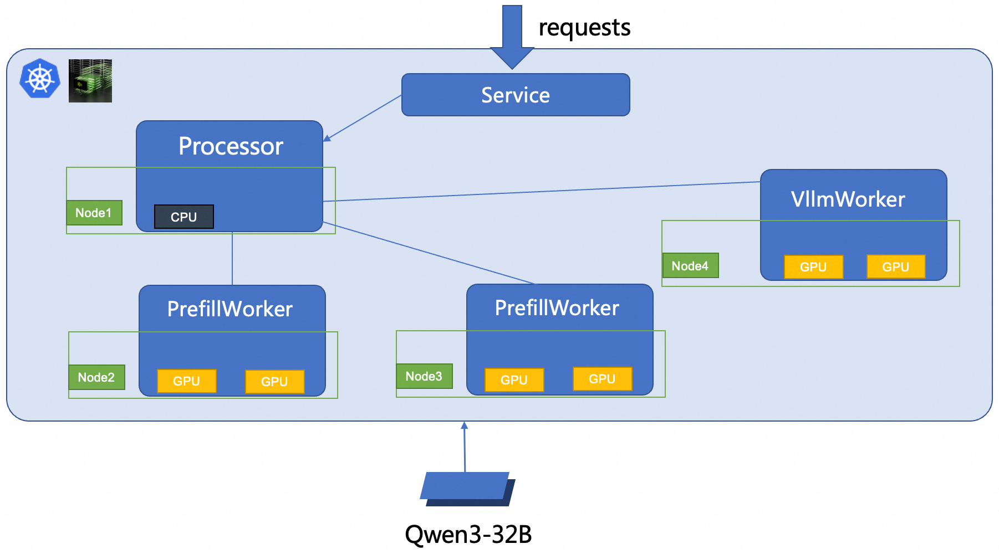

# Prefill-Decode-Disaggregating Inference

The sequence diagram for Dynamo PD separation is as follows. A user request is first sent to the processor component;
the router selects an appropriate Decode Worker and forwards the request to it. The Decode Worker determines whether the
prefill computation should be performed locally or remotely. If remote computation is required, it sends a request to
the PrefillQueue. A PrefillWorker pulls the request from the queue and performs the prefill computation; once complete,
it transfers the Prefill KVCache back to the Decode Worker.


## Prerequisites

1. A Kubernetes cluster with version >= 1.26 is Required, or it will behave unexpected.
2. Kubernetes cluster has at least 6+ CPUs with at least 32G VRAM available for the LLM Inference to run on.
3. The kubectl command-line tool has communication with your cluster. Learn how
   to [install the Kubernetes tools](https://kubernetes.io/docs/tasks/tools/).
4. Prepare the Qwen3-32B model files
    1. Run the following command to download the Qwen3-32B model from ModelScope:
   ```shell
   git lfs install
   GIT_LFS_SKIP_SMUDGE=1 git clone git clone https://www.modelscope.cn/Qwen/Qwen3-32B.git
   cd Qwen3-32B/
   git lfs pull
   ```
    2. Create an Object Storage Service (OSS) directory and upload the model files to the directory.
   ```shell
   ossutil mkdir oss://<your-bucket-name>/models/Qwen3-32B
   ossutil cp -r ./Qwen3-32B oss://<your-bucket-name>/models/Qwen3-32B
   ```
    3. Create a persistent volume (PV) and a persistent volume claim (PVC). Create a PV named llm-model and a PVC in the
       cluster.
   ```shell
   # replace OSS variables in model.yaml
   kubectl apply -f model.yaml
   ```

## Deploy Dynamo Inference Service

1. Install dependencies
    1. Deploy etcd service
   ```bash
   kubectl apply -f ./etcd.yaml
    ```
    2. Deploy NATS service
   ```bash
   kubectl apply -f nats.yaml
    ```
2. Build Image
   Prepare the Dynamo image. For detailed steps, refer to the
   Dynamo [documentation](https://github.com/ai-dynamo/dynamo/blob/0802ecd91f5ef42ec670880db0929a9bbd220157/components/backends/vllm/README.md#pull-or-build-container),
   or build a Dynamo container image that uses vLLM as the inference framework.


3. Deploy PD Disaggregation with Dynamo
   

```bash
kubectl apply -f dynamo-configs.yaml
kubectl apply -f ./dynamo.yaml
```

4. Verify the inference service

```bash
kubectl port-forward svc/dynamo-service 8000:8000

curl http://localhost:8000/v1/chat/completions   -H "Content-Type: application/json"   -d '{
    "model": "qwen",
    "messages": [
    {
        "role": "user",
        "content": "Tell me about the absolute legend Roger Federer"
    }
    ],
    "stream":false,
    "max_tokens": 30
  }'
```

Expected output:

```text
{"id":"2c0da9d2-d472-48c2-999e-aabf0fa2d97b","choices":[{"index":0,"message":{"content":"Roger Federer is widely regarded as one of the greatest tennis players of all time, known for his exceptional talent, grace, and sportsmanship both on","refusal":null,"tool_calls":null,"role":"assistant","function_call":null,"audio":null},"finish_reason":"length","logprobs":null}],"created":1744602609,"model":"qwen","service_tier":null,"system_fingerprint":null,"object":"chat.completion","usage":null}
```
